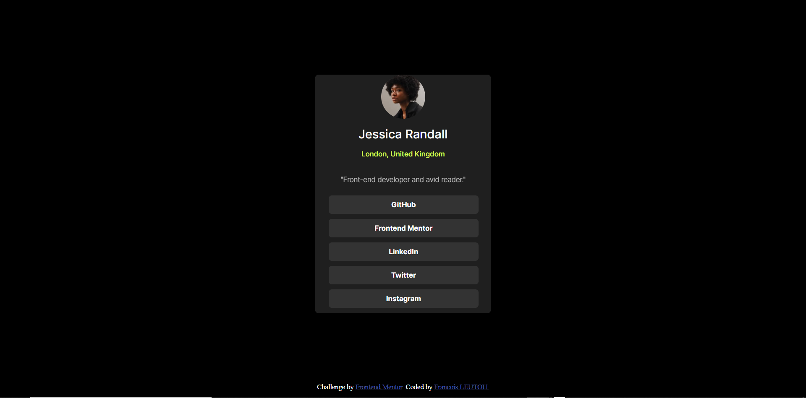

# Frontend Mentor - QR code component solution

This is a solution to the [Social Links Profile challenge on Frontend Mentor](https://https://www.frontendmentor.io/learning-paths/getting-started-on-frontend-mentor-XJhRWRREZd). Frontend Mentor challenges help you improve your coding skills by building realistic projects. 

## Table of contents

- [Overview](#overview)
  - [Screenshot](#screenshot)
  - [Links](#links)
- [My process](#my-process)
  - [Built with](#built-with)
  - [What I learned](#what-i-learned)
  - [Continued development](#continued-development)
- [Author](#author)

## Overview

### Screenshot




### Links

- [Solution](https://github.com/FrancisL0001/Social-links-Profile)
- [Live Site](https://social-links-profile-ten-nu-26.vercel.app/)

## My process

### Built with

- Semantic HTML5 markup
- CSS custom properties
- Flexbox
- Mobile-first workflow


### What I learned

This time, I learned importing of fonts both from remote(website) or from my personal repository using the syntax:

```css
@font-face {
    font-family: 'Inter';
    src: url("./assets/fonts/Inter-VariableFont_slnt,wght.ttf") format('ttf');
}
```

I also found a way to make my text responsive using the 
```css 
clamp()
```
 function in CSS. That was a nice thing.

 Doing the hover using 
 ```css
 li a:hover{
    background-color:hsl(75, 98%, 66%);
    transition: all .3s ease;
    color: black;
}
```
was nice too.

### Continued development

Not much to add on this one. Eventually, I will surely use the layout to add my personal links for use in various situations. This should make getting to me way easier in the future. 


## Author

- Frontend Mentor - [FrancisL001](https://www.frontendmentor.io/profile/FrancisL001)
- GitHub - [@FrancisL0001](https://github.com/FrancisL0001)
